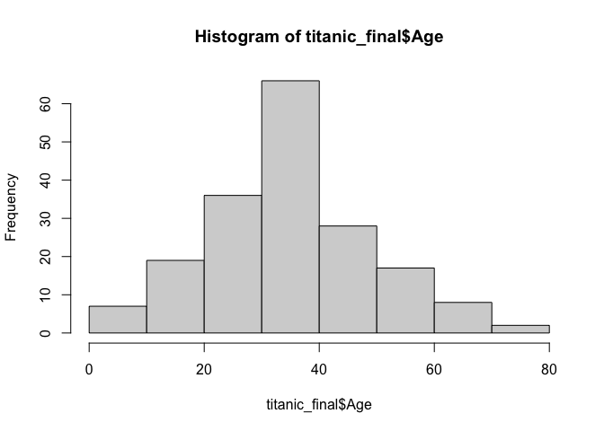
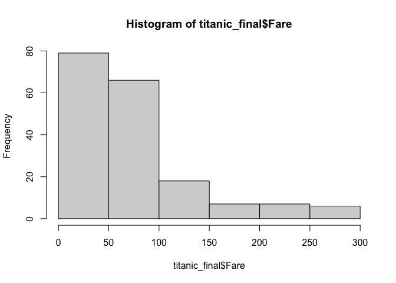
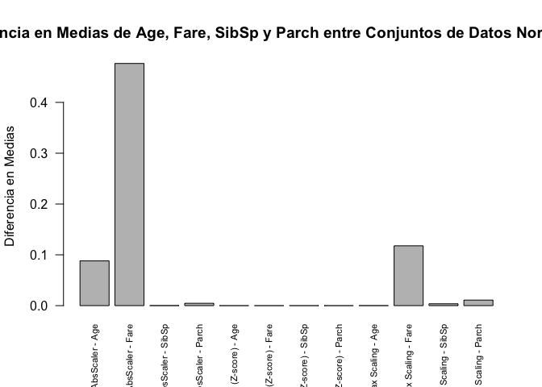

Lab#8
================
2023-10-29

``` r
knitr::opts_chunk$set(echo = TRUE)

library(caret)
```

    ## Loading required package: ggplot2

    ## Loading required package: lattice

``` r
titanic_MD <- read.csv("titanic_MD.csv")
titanic_og <- read.csv("titanic.csv")
str(titanic_MD)
```

    ## 'data.frame':    183 obs. of  12 variables:
    ##  $ PassengerId: int  2 4 7 11 12 22 24 28 53 55 ...
    ##  $ Survived   : int  1 1 0 1 1 1 1 0 1 0 ...
    ##  $ Pclass     : int  1 1 1 3 1 2 1 1 1 1 ...
    ##  $ Name       : chr  "Cumings, Mrs. John Bradley (Florence Briggs Thayer)" "Futrelle, Mrs. Jacques Heath (Lily May Peel)" "McCarthy, Mr. Timothy J" "Sandstrom, Miss. Marguerite Rut" ...
    ##  $ Sex        : chr  "?" "female" "male" "female" ...
    ##  $ Age        : num  38 35 54 NA 58 34 NA 19 49 65 ...
    ##  $ SibSp      : int  1 1 0 1 NA 0 0 3 1 0 ...
    ##  $ Parch      : int  0 0 0 NA 0 0 0 2 NA 1 ...
    ##  $ Ticket     : chr  "PC 17599" "113803" "17463" "PP 9549" ...
    ##  $ Fare       : num  71.3 53.1 51.9 16.7 26.6 ...
    ##  $ Cabin      : chr  "C85" "C123" "E46" "G6" ...
    ##  $ Embarked   : chr  "C" "S" "S" "S" ...

``` r
summary(titanic_MD)
```

    ##   PassengerId       Survived          Pclass          Name          
    ##  Min.   :  2.0   Min.   :0.0000   Min.   :1.000   Length:183        
    ##  1st Qu.:263.5   1st Qu.:0.0000   1st Qu.:1.000   Class :character  
    ##  Median :457.0   Median :1.0000   Median :1.000   Mode  :character  
    ##  Mean   :455.4   Mean   :0.6721   Mean   :1.191                     
    ##  3rd Qu.:676.0   3rd Qu.:1.0000   3rd Qu.:1.000                     
    ##  Max.   :890.0   Max.   :1.0000   Max.   :3.000                     
    ##                                                                     
    ##      Sex                 Age            SibSp            Parch      
    ##  Length:183         Min.   : 0.92   Min.   :0.0000   Min.   :0.000  
    ##  Class :character   1st Qu.:24.00   1st Qu.:0.0000   1st Qu.:0.000  
    ##  Mode  :character   Median :35.50   Median :0.0000   Median :0.000  
    ##                     Mean   :35.69   Mean   :0.4611   Mean   :0.462  
    ##                     3rd Qu.:48.00   3rd Qu.:1.0000   3rd Qu.:1.000  
    ##                     Max.   :80.00   Max.   :3.0000   Max.   :4.000  
    ##                     NA's   :25      NA's   :3        NA's   :12     
    ##     Ticket               Fare           Cabin             Embarked        
    ##  Length:183         Min.   :  0.00   Length:183         Length:183        
    ##  Class :character   1st Qu.: 29.70   Class :character   Class :character  
    ##  Mode  :character   Median : 56.93   Mode  :character   Mode  :character  
    ##                     Mean   : 78.96                                        
    ##                     3rd Qu.: 90.54                                        
    ##                     Max.   :512.33                                        
    ##                     NA's   :8

``` r
titanic_MD2 <- titanic_MD
titanic_MD3 <- titanic_MD
titanic_MD4 <- titanic_MD
titanic_final <- titanic_MD
```

## Parte 1

### 1

``` r
#----*Parte 1*----
#1
missing_data_summary <- sapply(titanic_MD, function(x) sum(is.na(x)))
missing_data_summary
```

    ## PassengerId    Survived      Pclass        Name         Sex         Age 
    ##           0           0           0           0           0          25 
    ##       SibSp       Parch      Ticket        Fare       Cabin    Embarked 
    ##           3          12           0           8           0           0

### 2

Age: se utilizo la mediana porque evita los valores extremos o atípicos
como puede ser la media por lo que obtrenda un valor representativo de
las edades.

Fare: se utilizo la moda porque el valor más comun en este caso puede
ser el más representativo.

SibSp: tambien se utilizo la moda ya que es una variable discreta, y
representa un valor que es el más comun entre los pasajeros.

Parch: es igual que SibSp por lo que se utilizo la moda ya que es una
variable discreta, y representa el valor más comun entre los pasajeros.

Sex: en este caso se hizo una proporcion de que cuantos eran mujeres y
cuantos eran hombres y basados en en esos porcentajes se dividio las
observaciones que tenian un ?

### 3

``` r
complete_rows <- complete.cases(titanic_MD)
num_complete_rows <- sum(complete_rows)
num_complete_rows
```

    ## [1] 141

``` r
percentage_complete_rows <- (num_complete_rows / nrow(titanic_MD)) * 100
percentage_complete_rows
```

    ## [1] 77.04918

### 4

    ## 
    ##      ? female   male 
    ##     51     64     68

    ## [1] 51

    ## [1] 26

    ## [1] 25

    ## PassengerId    Survived      Pclass        Name         Sex         Age 
    ##           0           0           0           0           0           1 
    ##       SibSp       Parch      Ticket        Fare       Cabin    Embarked 
    ##           1           0           0           0           0           0

    ## [1] 182

    ## [1] 99.45355

    ## PassengerId    Survived      Pclass        Name         Sex         Age 
    ##           0           0           0           0           0           0 
    ##       SibSp       Parch      Ticket        Fare       Cabin    Embarked 
    ##           0           0           0           0           0           0

    ## [1] 183

    ## [1] 100

    ## PassengerId    Survived      Pclass        Name         Sex         Age 
    ##           0           0           0           0           0          25 
    ##       SibSp       Parch      Ticket        Fare       Cabin    Embarked 
    ##           3          12           0           8           0           0

    ## [1] 141

    ## [1] 77.04918

### 5

``` r
#Calcular RMSE para Age y Fare
rmse_age <- sqrt(mean((titanic_og$Age - titanic_MD2$Age[!is.na(titanic_og$Age)])^2, na.rm = TRUE))
rmse_age
```

    ## [1] 5.116459

``` r
rmse_fare <- sqrt(mean((titanic_og$Fare - titanic_MD2$Fare[!is.na(titanic_og$Fare)])^2, na.rm = TRUE))
rmse_fare
```

    ## [1] 12.48642

``` r
rmse_sibsp <- sqrt(mean((titanic_og$SibSp - titanic_MD2$SibSp[!is.na(titanic_og$SibSp)])^2, na.rm = TRUE))
rmse_sibsp
```

    ## [1] 0.04946048

``` r
rmse_parch <- sqrt(mean((titanic_og$Parch - titanic_MD2$Parch[!is.na(titanic_og$Parch)])^2, na.rm = TRUE))
rmse_parch
```

    ## [1] 0.2022867

``` r
#Calcular tasa de coincidencia para SibSp y Parch
coincidence_fare <- sum(titanic_og$Fare == titanic_MD3$Fare) / nrow(titanic_og)
coincidence_fare
```

    ## [1] 0.9562842

``` r
coincidence_age <- sum(titanic_og$Age == titanic_MD3$Age) / nrow(titanic_og)
coincidence_age
```

    ## [1] 0.863388

``` r
coincidence_sibsp <- sum(titanic_og$SibSp == titanic_MD3$SibSp) / nrow(titanic_og)
coincidence_sibsp
```

    ## [1] 0.989071

``` r
coincidence_parch <- sum(titanic_og$Parch == titanic_MD3$Parch) / nrow(titanic_og)
coincidence_parch
```

    ## [1] 0.9672131

### 6

Age: tiene un RMSE de 5.12 lo cual no es muy bueno, pero la tasa de
coincidencia es de 86.3% lo que es muy cercano las edades originales.
Por lo tanto, la imputacion general es la mejor opción.

Fare:tiene un RMSE de 12.49 lo cual esta lejos de 0, pero la tasa de
coincidencia es de 95.63% lo que es bueno. Por lo tanto, la imputacion
general es la mejor opción.

sibsp: tiene un RMSE de 0.05, y una tasa de concidencia de 98.91% esto
nos dice que ambos metodos son buenos pero por parsimonia se utilizara
la imputacion general.

Parch: tiene un RMSE de 0.20,con una tasa de coincidencia de 96.7% por
lo que ambos metodos son bueno pero por parsimonia se utilizara la
imputacion general.

## Parte 2

``` r
#PRE-PROCESAMIENTO

sex_table <- table(titanic_final$Sex)
sex_table
```

    ## 
    ##      ? female   male 
    ##     51     64     68

``` r
most_common_sex <- names(sex_table)[which.max(sex_table)]

count_question_marks <- sum(titanic_final$Sex == "?")
count_question_marks
```

    ## [1] 51

``` r
count_male <- round(0.5152 * count_question_marks)
count_male
```

    ## [1] 26

``` r
count_female <- count_question_marks - count_male
count_female
```

    ## [1] 25

``` r
titanic_final$Sex <- ifelse(titanic_final$Sex == "?", ifelse(seq_along(titanic_final$Sex)
                                                             <= count_male, "male", "female"), titanic_final$Sex)


median_age <- median(titanic_final$Age, na.rm = TRUE)
titanic_final$Age[is.na(titanic_final$Age)] <- median_age


z_scores <- scale(titanic_final$Fare)
threshold <- 3
outliers <- which(abs(z_scores) > threshold)
titanic_final$Fare[outliers] <- NA 

mode_fare <- as.numeric(names(sort(table(titanic_final$Fare), decreasing = TRUE)[1]))
titanic_final$Fare[is.na(titanic_final$Fare)] <- mode_fare


mode_sibsp <- names(sort(table(titanic_final$SibSp), decreasing = TRUE)[1])
titanic_final$SibSp[is.na(titanic_final$SibSp)] <- mode_sibsp

mode_parch <- names(sort(table(titanic_final$Parch), decreasing = TRUE)[1])
titanic_final$Parch[is.na(titanic_final$Parch)] <- mode_parch

missing_data_summary_final<- sapply(titanic_final, function(x) sum(is.na(x)))
missing_data_summary_final
```

    ## PassengerId    Survived      Pclass        Name         Sex         Age 
    ##           0           0           0           0           0           0 
    ##       SibSp       Parch      Ticket        Fare       Cabin    Embarked 
    ##           0           0           0           0           0           0

``` r
complete_rows_final <- complete.cases(titanic_final)
num_complete_rows_final <- sum(complete_rows_final)
num_complete_rows_final
```

    ## [1] 183

``` r
percentage_complete_rows_final <- (num_complete_rows_final / nrow(titanic_final)) * 100
percentage_complete_rows_final
```

    ## [1] 100

``` r
#Normalizar
data <- titanic_final[, c("Age", "Fare", "SibSp", "Parch")]
data <- as.data.frame(lapply(data, as.numeric))

#a. Standarization (Z-score)
preproc_stand <- preProcess(data, method = c("center", "scale"))
data_stand <- predict(preproc_stand, newdata = data)

#b. Min-Max Scaling
preproc_minmax <- preProcess(data, method = c("range"))
data_minmax <- predict(preproc_minmax, newdata = data)

#Calcular los valores máximos absolutos para cada columna
max_abs_values <- apply(data, 2, function(x) max(abs(x), na.rm = TRUE))

#Asegurarse de que los valores máximos absolutos no sean cero
max_abs_values[max_abs_values == 0] <- 1

#Realizar la normalización MaxAbsScaler
data_maxabs <- data / max_abs_values

print("MaxAbsScaler")
```

    ## [1] "MaxAbsScaler"

``` r
head(data_maxabs)
```

    ##          Age       Fare       SibSp Parch
    ## 1  0.4750000 17.8208250 0.333333333     0
    ## 2  0.1330798  0.6637500 0.250000000     0
    ## 3 18.0000000  0.1971958 0.000000000     0
    ## 4  8.8750000  5.5666667 0.003802281     0
    ## 5  0.7250000  6.6375000 0.000000000     0
    ## 6  0.1292776  0.1625000 0.000000000     0

``` r
print("Standarization (Z-score)")
```

    ## [1] "Standarization (Z-score)"

``` r
head(data_stand)
```

    ##           Age         Fare      SibSp      Parch
    ## 1  0.16064933 -0.001244558  0.8492353 -0.5856282
    ## 2 -0.04586112 -0.300125321  0.8492353 -0.5856282
    ## 3  1.26203840 -0.320466235 -0.7048653 -0.5856282
    ## 4 -0.01144271 -0.898435845  0.8492353 -0.5856282
    ## 5  1.53738567 -0.736530388 -0.7048653 -0.5856282
    ## 6 -0.11469794 -0.959253124 -0.7048653 -0.5856282

``` r
print("Min-Max Scaling")
```

    ## [1] "Min-Max Scaling"

``` r
head(data_minmax)
```

    ##         Age       Fare     SibSp Parch
    ## 1 0.4688923 0.27103916 0.3333333     0
    ## 2 0.4309560 0.20190114 0.3333333     0
    ## 3 0.6712190 0.19719582 0.0000000     0
    ## 4 0.4372787 0.06349810 0.3333333     0
    ## 5 0.7218007 0.10095057 0.0000000     0
    ## 6 0.4183106 0.04942966 0.0000000     0

``` r
#2
titanic_data_subset <- titanic_og[, c("Age", "Fare", "SibSp", "Parch")]
#Normalización MaxAbsScaler
max_abs_values_complete <- apply(titanic_data_subset, 2, function(x) max(abs(x), na.rm = TRUE))
max_abs_values_complete[max_abs_values_complete == 0] <- 1
titanic_data_maxabs <- titanic_data_subset / max_abs_values_complete

#Normalización Z-score (Standarization)
preproc_stand_complete <- preProcess(titanic_data_subset, method = c("center", "scale"))
titanic_data_stand <- predict(preproc_stand_complete, newdata = titanic_data_subset)

#Normalización Min-Max Scaling
preproc_minmax_complete <- preProcess(titanic_data_subset, method = c("range"))
titanic_data_minmax <- predict(preproc_minmax_complete, newdata = titanic_data_subset)

#Estadísticos de los datos normalizados
stats_data_maxabs <- summary(data_maxabs)
stats_data_stand <- summary(data_stand)
stats_data_minmax <- summary(data_minmax)

#Estadísticos de la data completa normalizada
stats_titanic_maxabs <- summary(titanic_data_maxabs)
stats_titanic_stand <- summary(titanic_data_stand)
stats_titanic_minmax <- summary(titanic_data_minmax)

#Calcular las medias (promedios) para Age, Fare, SibSp y Parch en cada conjunto de datos normalizado
mean_data_maxabs_age <- mean(data_maxabs$Age, na.rm = TRUE)
mean_data_stand_age <- mean(data_stand$Age, na.rm = TRUE)
mean_data_minmax_age <- mean(data_minmax$Age, na.rm = TRUE)

mean_titanic_maxabs_age <- mean(titanic_data_maxabs$Age, na.rm = TRUE)
mean_titanic_stand_age <- mean(titanic_data_stand$Age, na.rm = TRUE)
mean_titanic_minmax_age <- mean(titanic_data_minmax$Age, na.rm = TRUE)

mean_data_maxabs_fare <- mean(data_maxabs$Fare, na.rm = TRUE)
mean_data_stand_fare <- mean(data_stand$Fare, na.rm = TRUE)
mean_data_minmax_fare <- mean(data_minmax$Fare, na.rm = TRUE)

mean_titanic_maxabs_fare <- mean(titanic_data_maxabs$Fare, na.rm = TRUE)
mean_titanic_stand_fare <- mean(titanic_data_stand$Fare, na.rm = TRUE)
mean_titanic_minmax_fare <- mean(titanic_data_minmax$Fare, na.rm = TRUE)

mean_data_maxabs_sibsp <- mean(data_maxabs$SibSp, na.rm = TRUE)
mean_data_stand_sibsp <- mean(data_stand$SibSp, na.rm = TRUE)
mean_data_minmax_sibsp <- mean(data_minmax$SibSp, na.rm = TRUE)

mean_titanic_maxabs_sibsp <- mean(titanic_data_maxabs$SibSp, na.rm = TRUE)
mean_titanic_stand_sibsp <- mean(titanic_data_stand$SibSp, na.rm = TRUE)
mean_titanic_minmax_sibsp <- mean(titanic_data_minmax$SibSp, na.rm = TRUE)

mean_data_maxabs_parch <- mean(data_maxabs$Parch, na.rm = TRUE)
mean_data_stand_parch <- mean(data_stand$Parch, na.rm = TRUE)
mean_data_minmax_parch <- mean(data_minmax$Parch, na.rm = TRUE)

mean_titanic_maxabs_parch <- mean(titanic_data_maxabs$Parch, na.rm = TRUE)
mean_titanic_stand_parch <- mean(titanic_data_stand$Parch, na.rm = TRUE)
mean_titanic_minmax_parch <- mean(titanic_data_minmax$Parch, na.rm = TRUE)
```

``` r
#Comparación de medias (promedios) para Age, Fare, SibSp y Parch en MaxAbsScaler
mean_difference_maxabs_age <- abs(mean_data_maxabs_age - mean_titanic_maxabs_age)
mean_difference_maxabs_age
```

    ## [1] 0.08807668

``` r
mean_difference_maxabs_fare <- abs(mean_data_maxabs_fare - mean_titanic_maxabs_fare)
mean_difference_maxabs_fare
```

    ## [1] 0.4765939

``` r
mean_difference_maxabs_sibsp <- abs(mean_data_maxabs_sibsp - mean_titanic_maxabs_sibsp)
mean_difference_maxabs_sibsp
```

    ## [1] 0.000146511

``` r
mean_difference_maxabs_parch <- abs(mean_data_maxabs_parch - mean_titanic_maxabs_parch)
mean_difference_maxabs_parch
```

    ## [1] 0.004655616

``` r
#Comparación de medias (promedios) para Age, Fare, SibSp y Parch en Standarization (Z-score)
mean_difference_stand_age <- abs(mean_data_stand_age - mean_titanic_stand_age)
mean_difference_stand_age
```

    ## [1] 1.37119e-16

``` r
mean_difference_stand_fare <- abs(mean_data_stand_fare - mean_titanic_stand_fare)
mean_difference_stand_fare
```

    ## [1] 1.771503e-16

``` r
mean_difference_stand_sibsp <- abs(mean_data_stand_sibsp - mean_titanic_stand_sibsp)
mean_difference_stand_sibsp
```

    ## [1] 4.610762e-17

``` r
mean_difference_stand_parch <- abs(mean_data_stand_parch - mean_titanic_stand_parch)
mean_difference_stand_parch
```

    ## [1] 9.464196e-17

``` r
#Comparación de medias (promedios) para Age, Fare, SibSp y Parch en Min-Max Scaling
mean_difference_minmax_age <- abs(mean_data_minmax_age - mean_titanic_minmax_age)
mean_difference_minmax_age
```

    ## [1] 0.000103651

``` r
mean_difference_minmax_fare <- abs(mean_data_minmax_fare - mean_titanic_minmax_fare)
mean_difference_minmax_fare
```

    ## [1] 0.1177491

``` r
mean_difference_minmax_sibsp <- abs(mean_data_minmax_sibsp - mean_titanic_minmax_sibsp)
mean_difference_minmax_sibsp
```

    ## [1] 0.003642987

``` r
mean_difference_minmax_parch <- abs(mean_data_minmax_parch - mean_titanic_minmax_parch)
mean_difference_minmax_parch
```

    ## [1] 0.01092896

``` r
hist(titanic_final$Age)
```

<!-- -->

``` r
hist(titanic_final$Fare)
```

<!-- -->

``` r
barplot(
  c(
    mean_difference_maxabs_age, mean_difference_maxabs_fare, mean_difference_maxabs_sibsp, mean_difference_maxabs_parch,
    mean_difference_stand_age, mean_difference_stand_fare, mean_difference_stand_sibsp, mean_difference_stand_parch,
    mean_difference_minmax_age, mean_difference_minmax_fare, mean_difference_minmax_sibsp, mean_difference_minmax_parch
  ),
  names.arg = c(
    "MaxAbsScaler - Age", "MaxAbsScaler - Fare", "MaxAbsScaler - SibSp", "MaxAbsScaler - Parch",
    "Standarization (Z-score) - Age", "Standarization (Z-score) - Fare", "Standarization (Z-score) - SibSp", "Standarization (Z-score) - Parch",
    "Min-Max Scaling - Age", "Min-Max Scaling - Fare", "Min-Max Scaling - SibSp", "Min-Max Scaling - Parch"
  ),
  main = "Diferencia en Medias de Age, Fare, SibSp y Parch entre Conjuntos de Datos Normalizados",
  ylab = "Diferencia en Medias",
  las = 2,
  cex.names = 0.7 
)
```

<!-- -->

### Conclusiones

Standarization: En general, para age, fare, sibsp y parch son mínimas,
por lo que indica que las medias son prácticamente idénticas.

MinMax Scaling: \* Age: La diferencia en la media es aproximadamente de
0.0001, lo cual es mínimo. \* Fare: La diferencia en la media es de
aprox 0.004, esto también es mínimo por lo que está muy cercano a la
media. \* SibSp: la diferencia en la media es mayor en comparación con
MaxAbsScaler, siendo aprox de 0.0036, aun así es mínimo. \* Parch: Este
también es mayor que MaxAbsScaler siendo de 0.011, a pesar de, sigue
siendo una diferencia muy pequeña.

Max Abs Scaler: \* Age: la diferencia de la media es aprox 0.071, lo que
indica que hay una pequeña diferencia con el original. \* Fare: la
diferencia en la media es aprox de 0.44, lo que indica que hay una
diferencia notable. \* SibSp: la diferencia es mínima de 0.00014, lo que
es muy cercano a cero. \* Parch: la diferencia en la media tambien es
minima de 0.005 lo que nos dice que si esta cerca del original.

En conclusión, todos están muy cercanos en la media, la única variable
con la que se debe poner más atención es Fare porque tiene una
diferencia más notable.
